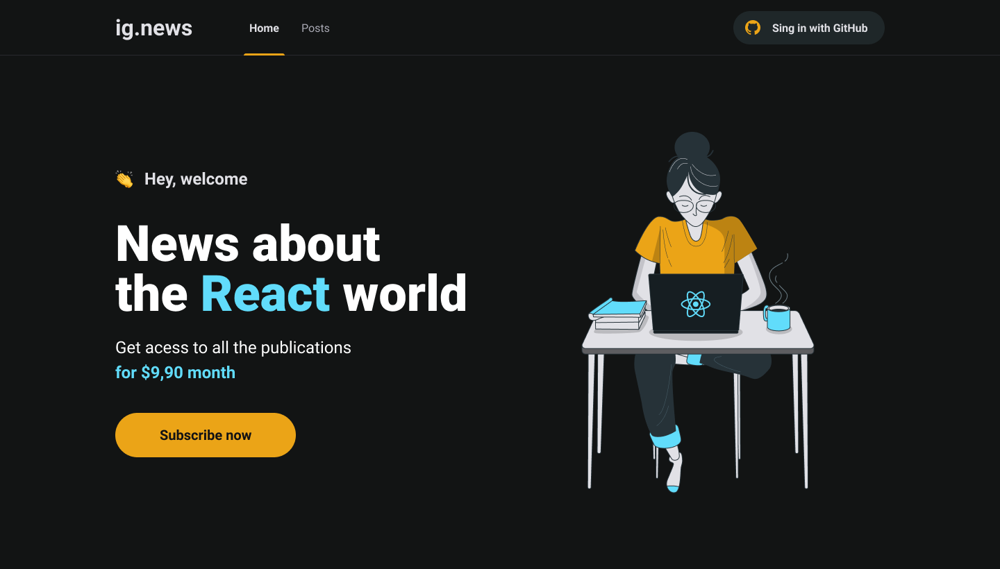
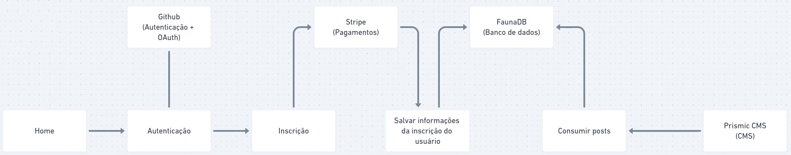
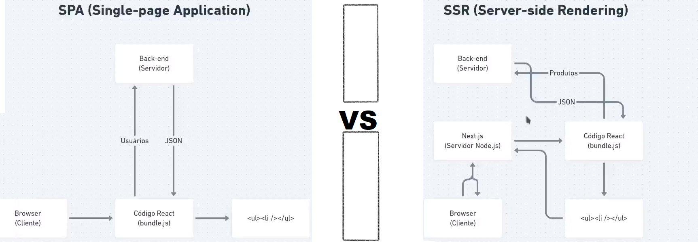
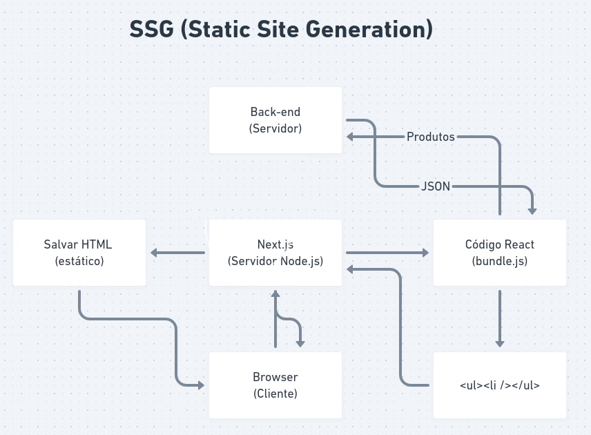

<h1 align="center">
    
</h1>

<p align="center">
  

  

  <a href="https://github.com//leocairos/ignite-ignews/commits/master">
    
  </a>

  
   <a href="https://github.com/leocairos/ignite-ignews/stargazers">
    
  </a>

  <a href="https://www.linkedin.com/in/leonardo-sampaio-cairo-54a74756/">
    
  </a>
</p>

# 🚀 Sobre

O Ignite é um programa de aceleração para devs desenvolvido pela [Rocketseat](https://rocketseat.com.br/).


## 💻 Sobre o Rentx

Trata-se de app para assinatura de conteudos (texto).

<h1 align="center">
    
</h1>

[Oficial Figma](https://www.figma.com/file/gl0fHkQgvaUfXNjuwGtDDs/ig.news?node-id=1%3A2) |
[Copy of Oficial Figma](https://www.figma.com/file/HTnWm1Z088nZp9S0fqvnM1/ig.news-Copy?node-id=1%3A2)

### Diagrama de fluxo do APP

<h1 align="center">
    
</h1>

### APP model SPA (Single Page Application) vs SSR (Server Side Rendering)

<h1 align="center">
    
</h1>

### SSG (Static Site Generation)

<h1 align="center">
    
</h1>

### When use SPA, SSR and SSG

- SPA (client-side) dynamic information not recomended for informatin indexation on searchs
  * by useEfect
- SSR (server-side) dynamic information, especific information for a especific user
  * by GetServerSideProps
- SSG (static) static information, generic information for all users.
  * by GetStaticProps

### Execute

```bash
git clone
cd ignite-ignews
```

## Plugins - Dev

* VSCode CSS Modules
  - Extension for CSS Modules, which supports:
    * autocomplete
    * go to definition


## [Stripe](www.stripe.com)

* Create free login account
* Verify e-mail
* Create a Business Account
* Add a new product

* Developers >> API keys
  * Get a "Secret Key"
  * Create a .env.local file in root project path
  * Insert a propertie STRIPE_API_KEY with Secret Key value copied

* Optimal
  * Settings >> Branding:
    * Brand color
    * Accent color
    * Icon
    * Logo

* Hooks
  * settings >> checkout settings >> Clients & Server Integration >> Configure webhooks
    * Install Cli for Dev mode
      * Download/Install
      * run command in prompt/shell: $ stripe login
      * execute client: $ stripe listen --forward-to localhost:3000/api/webhooks
    * Or, configure endpoint for Prod mode

* Card for test
  * 4242 4242 4242 4242

## [FaunaDB](https://fauna.com/) Database for App serverless

* SignUp (Free account)
* Create Database
* Create New Key (in security)
* Create a New Collection (users)
* Create a Index for search
  * Source colletion: users
  * index name: user_by_email
  * terms: data.email
  * unique: true
  * serialized: true
* Create other Index for search
  * Source colletion: users
  * index name: user_by_stripe_customer_id
  * terms: data.stripe_customer_id
  * unique: false
  * serialized: true
* Create a New Collection (subscriptions)
* Create other Index for search
  * Source colletion: subscriptions
  * index name: subscription_by_id
  * terms: data.id
  * unique: false
  * serialized: true

*FaunaDB has a docker image for local use in dev mode.*

## JAMStack - JavaScript API Markup

### [Prismic CMS](https://prismic.io/)

* create a free account
* create a repository (NextJS)
* create a repeatable type
* create some documents by test
* configure API: Settnings >> API & Security
  * Set as Private API
  * Generate an Access Token
  * Copy "Permanent access tokens" to .env file


## Tips/Notes

* Set public e-mail on your github account
* CMS (Content Management System)
  - Wordpress
  x Drupal
  x Joomla
  x Magento (E-commerce)

* Headless CMS (Painel de administração + API HTTP, GraphQL, SDK)
  x Strapi
  - Ghost (Blog, muito bom)
  - keystone

  - GraphCMS ()
  - Prismic CMS (melhores planos)
  - Contentful (mais caro, porem mais completo)

  - Shopify
  - Saleor

* Uso do "prefetch" no component Link (from 'next/link') para pre-carregar a pagina tornando acesso mais rapido
  ```HTML
  <Link href="/posts" prefetch>
  ```

* Uso do 'cloneElement' para alterar propriedades de objetos filhos (children)
  ```javascript
  import { cloneElement} from "react"
  ...
    <Link {...rest}>
      {cloneElement(children, {
        className
      })}
    </Link>
  ```

## 📝 Licença

Este projeto esta sob a licença MIT.

Feito com ❤️ por [Leonardo Cairo](https://www.linkedin.com/in/leonardo-sampaio-cairo-54a74756/)!
